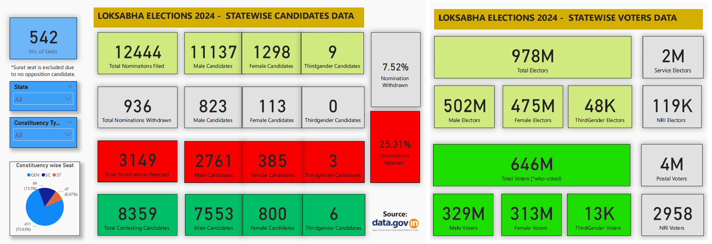

# LoksabhaElections2024
Data Visualization of India's Loksabha Elections 2024

# 🗳️ Lok Sabha Elections 2024 – Power BI Analysis

This project presents a comprehensive **Power BI dashboard** analyzing the **2024 Indian General Elections (Lok Sabha)** using publicly available data. The dashboard offers deep insights into electoral participation, candidate demographics, voter turnout, and gender representation across Indian states and union territories.

---

## 📌 Project Overview

The **2024 Lok Sabha Elections** marked another milestone in the world’s largest democracy. Using Power BI, this project visualizes crucial metrics including:

- Nominations filed, withdrawn, and rejected
- Gender-wise and thirdgender participation
- Voter turnout, non-voters, and postal/NRI voting
- Statewise electoral dynamics
- Vote share analysis of winning candidates

---

## 📊 Key Metrics

| Metric | Value |
|--------|-------|
| Total Seats | 542 |
| Total Nominations | 12,444 |
| Contesting Candidates | 8,359 |
| Voter Turnout | 646M / 978M (66%) |
| Female Candidates | 800 |
| Thirdgender Candidates | 6 |

---

## 📁 Project Files

| File | Description |
|------|-------------|
| `Loksabha_Elections_2024_Analysis.pbix` | Power BI file with all visuals & measures |
| `Loksabha_Elections_2024_Analysis.pdf` | Exported PDF version of the report |
| `screenshots/` | Folder with visuals used in README & blog |
| `README.md` | This documentation file |

---

## 📊 Dashboard Highlights

- ✅ KPIs and Gender-based nomination statistics
- 🌍 Statewise nomination, withdrawal, and rejection patterns
- 👥 Voter participation by gender and thirdgender
- 🗳️ Contest vs Nomination % heatmaps
- 📬 Postal & NRI voters analysis
- 📈 Vote share distribution of winners

---

## 📖 Related Article

📝 **Medium Blog Article:**  
[Lok Sabha Elections 2024 – A Power BI Exploration](https://thelastdanc3.medium.com/lok-sabha-elections-2024-a-data-driven-power-bi-analysis-of-indias-democratic-pulse-25698c377dc1)

---

## 🛠️ Tools Used

- **Power BI Desktop**
- **DAX** (for calculated measures)

---

## 📚 Data Sources

- Election Commission of India – [https://eci.gov.in](https://eci.gov.in)
- Open Government Data Platform India  [https://www.data.gov.in/](https://www.data.gov.in/)

---

## 📌 Author

👤 **Atanu Das**  
🎓 CSE Undergraduate | Cybersecurity Enthusiast  
🔗 [LinkedIn](https://linkedin.com/in/atanudasd2016/) 

---

> ⭐ Feel free to star this repo if you found it helpful or use it in your portfolio. Contributions, feedback, or suggestions are welcome!
